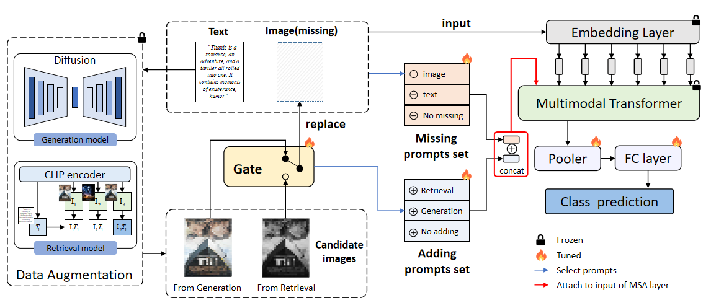

# Enhancing Multimodal Classification Robustness through Multi-Source Augmentation and Composite Prompts Method for Missing Modality

Official PyTorch implementaton of paper ：Enhancing Multimodal Classification Robustness through Multi-Source Augmentation and Composite Prompts Method for Missing Modality

## Introduction

This paper introduces an innovative multi-source augmentation and composite prompts method to alleviate missing modality. We used retrieval-based and generation-based methods to recover the missing modal data and designed a gate unit to enable the model to automatically select better sources of augmentation data. Then, we design a composite prompts method to fine-tune the model, guiding it to handle various input situations better and discover connections between them.

<div align="center">
  
</div>

## Usage

### Enviroment

#### Prerequisites

Python = 3.7.13

Pytorch = 1.10.0

CUDA = 11.3

#### Other requirements

```
pip install -r requirements.txt
```

### Prepare Dataset

We use two vision and language datasets: [MM-IMDb](https://github.com/johnarevalo/gmu-mmimdb), [UPMC Food-101](https://visiir.isir.upmc.fr/explore), . Please download the datasets by yourself.

#### Data augmentation

We use the CLIP model to get the retrieval augmentation data and [Unidiffuser](https://github.com/thu-ml/unidiffuser) to get the generation augmentation data. the example codes are located in `data_augmentation/retrieval/retrieval.py` and `data_augmentation/generation/unidiffuser/sample.py`. These two files are written using the mmimdb dataset as examples. If you want to run these two files to produce augmentation data, make sure you have downloaded the dataset. And check to modify the path data in the code.

Please see `DATA.md` to organize the datasets

We use `pyarrow` to serialize the datasets, the conversion codes are located in `vilt/utils/wirte_*.py`. Run the following script to create the pyarrow binary file:

```
python make_arrow.py --dataset [DATASET] --root [YOUR_DATASET_ROOT]
```

### Evaluation

```
python run.py with data_root=<ARROW_ROOT> \
        num_gpus=<NUM_GPUS> \
        num_nodes=<NUM_NODES> \
        per_gpu_batchsize=<BS_FITS_YOUR_GPU> \
        <task_finetune_mmimdb or task_finetune_food101> \
        load_path=<MODEL_PATH> \
        exp_name=<EXP_NAME> \
        prompt_type=<PROMPT_TYPE> \
        test_ratio=<TEST_RATIO> \
        test_type=<TEST_TYPE> \
	add_type=both
        test_only=True   
```

### Train

1. Download the pre-trained ViLT model weights from [here](https://github.com/dandelin/ViLT.git).
2. Start to train.

```
python run.py with data_root=<ARROW_ROOT> \
        num_gpus=<NUM_GPUS> \
        num_nodes=<NUM_NODES> \
        per_gpu_batchsize=<BS_FITS_YOUR_GPU> \
        <task_finetune_mmimdb or task_finetune_food101> \
        load_path=<PRETRAINED_MODEL_PATH> \
        exp_name=<EXP_NAME>
```

## Acknowledgements

This code is based on [ViLT](https://github.com/dandelin/ViLT.git) and [Missing-aware-prompts](https://github.com/YiLunLee/missing_aware_prompts).
The code for the data augmentation part comes from CLIP and [Unidiffuser](https://github.com/thu-ml/unidiffuser)
